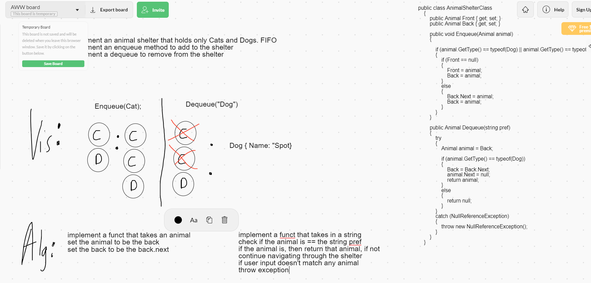

# Daily Code Challenge - Animal Shelter

## Perfect Sequence
*Author: Matthew Petersen*

---

### Problem Domain

Write the following methods that implement a FIFO principle: Enqueue(Animal), Dequeue(pref).

Create the following classes: Cat, Dog, Animal, AnimalShelter

Both Cat and Dog implement Animal

---

### Inputs and Expected Outputs

| Input | Expected Output | Method | 
| :------------------- | :---------------- |:----------- |
| Dog -> Null | Dog -> Cat -> Null | Enqueue(Cat) |
| Cat -> Cat -> Dog -> Null | Dog{Name = "Spot"} | Dequeue("dog") |

---

### Big O

| Time | Space |
| :----------- | :----------- |
| O(n) | O(n) |

---

### Whiteboard Visual
***[Your Whiteboard Image]***

---

### Change Log
01/26/2021 - Initial upload

---
