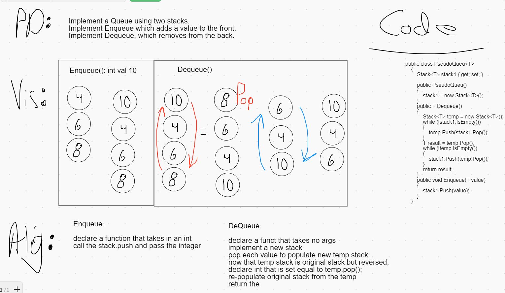

# Graphs

A data structure for representing nodes and their unique connections

## Challenge

Graph implemented with methods to add nodes, add edges, get a collection of all nodes, get neighbors of a given node, and check the size of the graph.

## Approach & Efficiency

Efficiency:
| Time | Space | Method |
| :----------- | :----------- |:----------- |
| O(1) | O(n) | AddNode |
| O(1) | O(1) | AddEdge |
| O(1) | O(1) | GetNodes |
| O(1) | O(1) | GetNeighbors |
| O(1) | O(1) | Size |

## Methods
  - addNode : Takes in a string, creates a GraphNode holding that string value and stores it in the Graph. Returns the GraphNode.
  - addEdge : Takes in two GraphNodes and an integer of weight created edges between the two nodes. If neither of the existing values are used for the edge, an exception is thrown.
  - getNodes : Returns a HashSet of GraphNodes, of all GraphNodes within the graph.
  - getNeighbors : Takes in a GraphNode and returns a HashSet with all the edges.
  - size : Returns an int of all the graph nodes.

# Whiteboard

  - 

