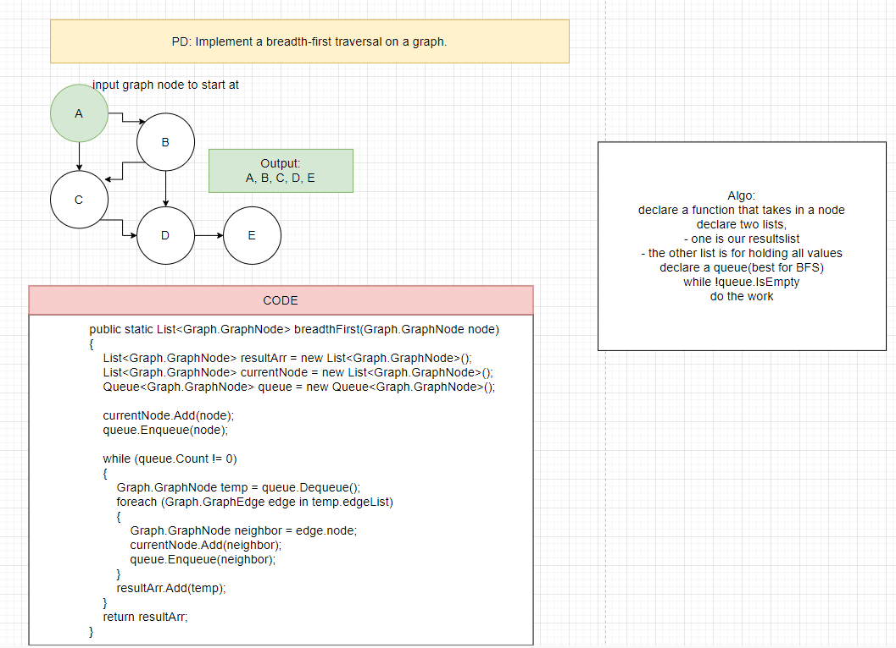

# Breadth first

Implement a breadth-first traversal on a graph.

## Challenge

Extend your graph object with a breadth-first traversal method that accepts a starting node. Without utilizing any of the built-in methods available to your language, return a collection of nodes in the order they were visited. Display the collection.

## Approach & Efficiency

Created a method that accepts a starting Node, queue will work great for this. The method returns a linkedList of all the nodes. Utilizing isEmpty() method, we will add all the children to the linkedlist until the queue is empty. Enqueue will add them, dequeue will remove the nodes. Lastly we will utilize the edge class to check if the neighbor has been visited.

Time:
- O(n)

Space:
- O(n)

## Whiteboard

