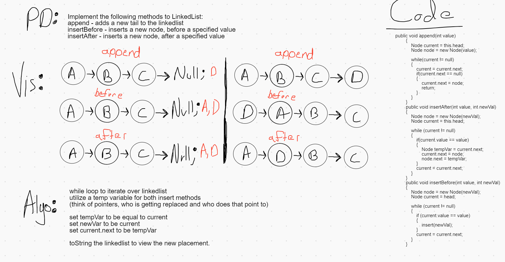

# Daily Code Challenge - LinkedList

## Perfect Sequence
*Author: Matthew Petersen*

---

### Problem Domain

Write the following methods that implement a linked list: Insert, Includes, toString, append, insertBefore, insertAfter.

---

### Inputs and Expected Outputs

| Input | Expected Output | Method | 
| :----------- | :----------- |:----------- |
| 1 -> 2 -> null, 5 | 5 -> 1 -> 2 -> null | Insert |
| 1 -> 2 -> null, 5 | true | Includes |
| 1 -> 2 -> null, 5 | "5 -> 1 -> 2 -> NULL" | toString |
| 1 -> 2 -> null, 5 | 1 -> 2 -> -> 5 -> null | Append |
| 1 -> 2 -> 3-> null, 2, 5 | 1 -> 2 -> 5 -> 3 -> null | insertAfter |
| 1 -> 2 -> null, 2, 5 | 1 -> 5 -> 2 -> NULL | insertBefore |
---

### Big O

| Time | Space |
| :----------- | :----------- |
| O(n) | O(n) |

LinkedLists are pretty simple, they have a head node which can reference a head.next. We can traverse a linkedlist by utilizing a while(head.next != null). This traverses the linkedlist until we hit the last node, because it points to null!

---

### Whiteboard Visual
***[Your Whiteboard Image]***

---

### Change Log
01/18/2021 - Added append, insertBefore, insertAfter. All tests passing!

---
