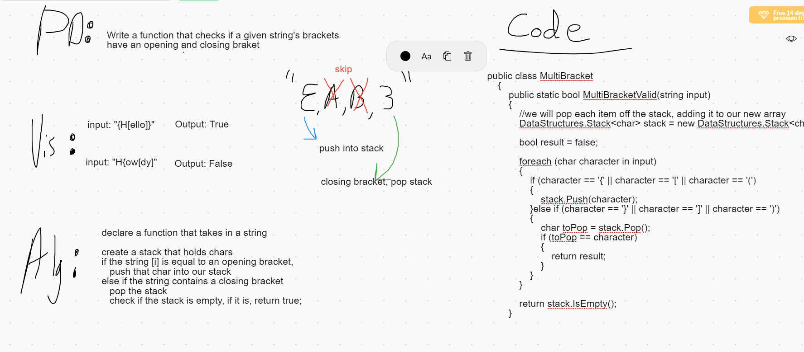

# Daily Code Challenge - MultiBracketValidation

## Perfect Sequence
*Author: Matthew Petersen*

---

### Problem Domain

Write a method that validates whether a bracket is balanced: {} () [].

---

### Inputs and Expected Outputs

| Input | Expected Output | Method | 
| :------------------- | :---------------- |:----------- |
| [Howdy] | TRUE | bracketValidation(input) |
| {{()}} | TRUE | bracketValidation(input) |
| [Broken]}{} | FALSE | bracketValidation(input) |

---

### Big O

| Time | Space |
| :----------- | :----------- |
| O(n) | O(n) |

The multi-bracket function has an efficient time and space complexity. You can see how I solved the problem below. First I check if the string input matches any of the bracket characters. If the character matches an opening bracket, I push it into a built in stack. If the character matches a closing bracket, I pop the stack. Lastly, I check if the stack is empty, if so then return true.

---

### Whiteboard Visual
***[Your Whiteboard Image]***

---

### Change Log
01/2/2021 - Initial upload. All tests passing!

---
