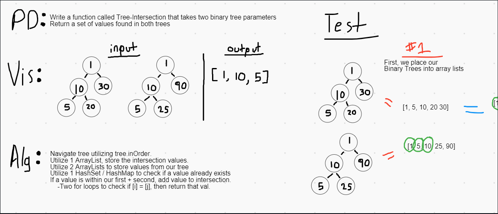

# Tree Intersection
- Utilize two Binary Search Trees, go through each tree and find the values that are found in both. Return those values.

# Solution
- This solution utilized a few steps, but it was great to solve!
- First, create an ArrayList for each tree, utilizing the tree in order method.
- Next, add one of those ArrayLists to a HashSet. We could have just utilized HashSets for the tree's values, but tree.inOrder requires an ArrayList.
- Declare a new ArrayList for all the intersection values.
- Lastly, check if the HashSet contains values from the ArrayList (utilize a for loop). If it does, add those values to the intersection ArrayList

## Efficiency
- Time: O(n)
    - The time efficiency is O(n) because we are reading through the tree twice. Once when the ArrayList is created, then again when the values are moved into the HashSet
- Space: O(1)
    - The space efficiency is O(1) because we are only declaring lists from existing values, then sorting through them. No new nodes/values are created.
    
# Whiteboards

