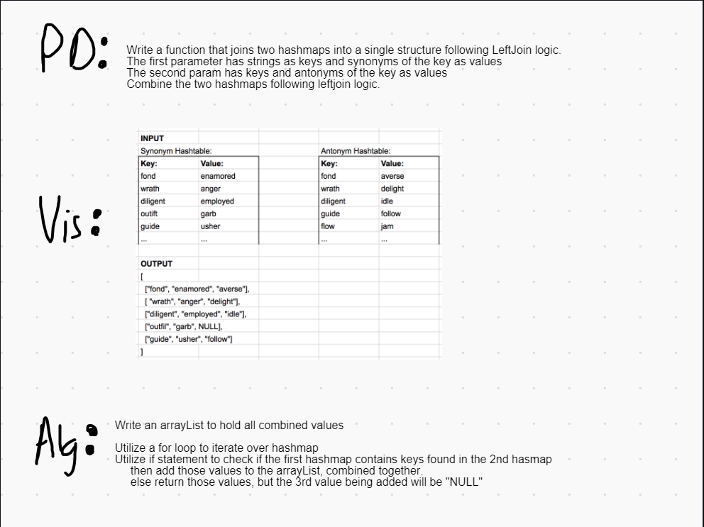

# Left Join
- Left Join takes two HashMaps as parameters. The left HashMap acts as the base, all of the keys and values are stored within an ArrayList. The right HashMap then checks the keys, if the keys match the value is then added to that key.

## Solution
- First I created an ArrayList to hold all of the values after they are combined.
- Implement a for loop that iterates over the first HashMap. Add the keys and values to the arraylist.
- Implement an if statement, checking if the ArrayList contains any keys from the second Hashmap.
    - If yes, then add the value to that key
    - If no, add "Null" to that key
- Return the resulting ArrayList.

## Efficiency
Time Efficiency: O(n)

Space Efficiency: O(n)

# Whiteboards

