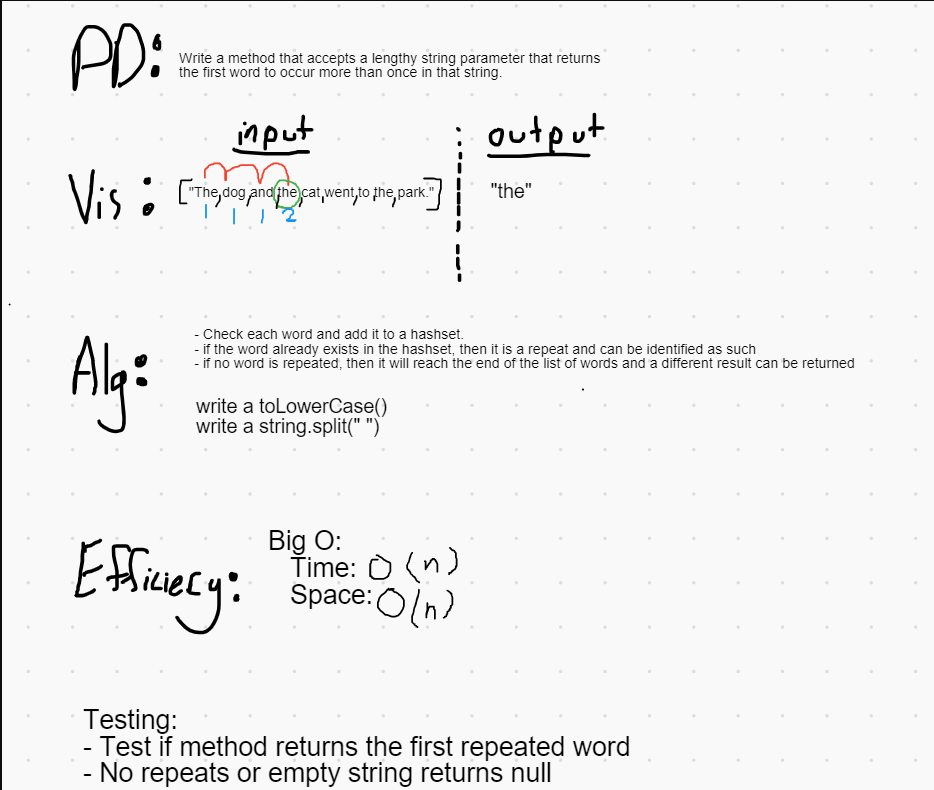

# RepeatedWord
- The repeated word method iterates over a string and can 

## Efficiency
- Time: O(n)
    - The time efficiency is O(n) because as we iterate through the for loop, we add the string (we have to iterate the entire array if no duplicates are found). Once a string is added twice we break the loop and print the result.
- Space: O(n)
    - The space efficiency is O(n) because the HashSet grows according to the size of the array if there is never a duplicate. 

## How to Run the File
1. Clone the git repo into the terminal using the command   
```
git clone https://github.com/mattpet26/dotnet2
```

2. After the repo is cloned, open the .sln within the dotnet2  

3. Check out the tests + code! 


# Whiteboards

